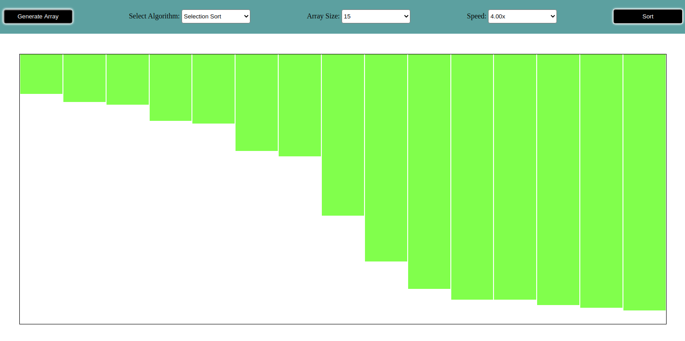

# Sorting-Visualizer

### Description
This repo consists of sorting algorithms visualizer created using **Javascript**, **HTML** and **CSS**.

The visualizer show some of the popular sorting algorithms in action.

Sorting Algorithms available -->

- Bubble Sort
- Selection Sort
- Insertion Sort
- Merge Sort
- Quick Sort

### Features
1. Select any algorithm for sorting.
2. Select the input size according to you.
3. Select the speed of sorting process.
4. Generate a new set of input at the click of a button.

### Preview

### How to Run
Open index.html in your browser.
